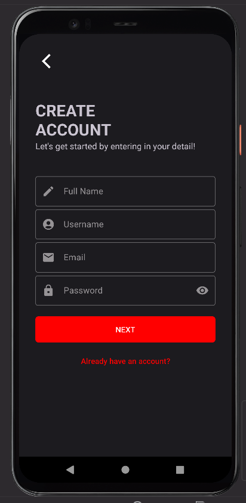

# Mobile Application Boilerplate

## Introduction
This repo to introduce the implementation for common component for UI/UX which consist feature such as login, landing page (a dasboard) and logout.

## Getting Started
1. Can work as a template for mobile application.
2. To use this template - create new repo and set MobileApp-Boilerplate as a template.

## UI / UX Design
1. Consist three main feature - Home, Camera, Settings.
2. For startup screen, consist feature for Login and Create Account.
3. For landing screen (Home & Camera) will be an empty screen. To fit with any project usage.
4. For settings screen, consist feature for Edit Profile and Logout.

## Features Availability
1. App support dark mode
2. OTP verification
3. Animation for more better experience
4. Responsive UI for mobile

### Demo

## Work in Progress
**Research & Development:**
- Tick box for Remember Me (TBC)
- OTP box and logic part (API back end)
- How to retrieve OTP (TBC)